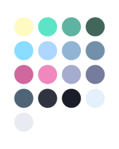

# poimandres theme for opencode.ai



A minimal, frameless dark theme for opencode.ai inspired by the [poimandres](https://github.com/drcmda/poimandres-theme) VS Code theme.

## Features

- Semantic color coding (errors in red, types darker, etc.)
- Minimal visual noise for better focus
- Optimized for truecolor terminals
- Based on the poimandres color palette

## Installation

### Global Installation

1. Create the themes directory:
```bash
mkdir -p ~/.config/opencode/themes
```

2. Download the theme file:
```bash
# Original theme
curl -o ~/.config/opencode/themes/poimandres.json https://raw.githubusercontent.com/ajaxdude/opencode-ai-poimandres-theme/main/.opencode/themes/poimandres.json

# Light theme variant
curl -o ~/.config/opencode/themes/poimandres-light.json https://raw.githubusercontent.com/ajaxdude/opencode-ai-poimandres-theme/main/.opencode/themes/poimandres-light.json
```

That's it! The theme is now available globally in opencode.ai.

## Usage

### Using the theme

1. Open opencode.ai
2. Type `/theme` and select a theme variant (`poimandres`, `poimandres-accessible`, or `poimandres-light`)
3. Or add it to your `opencode.json` config:

```json
{
  "$schema": "https://opencode.ai/config.json",
  "theme": "poimandres"
}
```

### Terminal Requirements

For best results, ensure your terminal supports **truecolor** (24-bit color):

- Check support: `echo $COLORTERM` (should output `truecolor` or `24bit`)
- Enable if needed: `export COLORTERM=truecolor`

Most modern terminals (iTerm2, Alacritty, Kitty, Windows Terminal, GNOME Terminal) support this by default.

### Switching Between Variants

Type `/theme` in opencode.ai and select from the available variants:
- `poimandres` - Original dark theme
- `poimandres-accessible` - WCAG AA compliant variant (recommended)
- `poimandres-light` - Light theme variant

Theme selections persist across opencode.ai sessions, so your choice will be remembered.

## Color Palette

The theme uses the poimandres color scheme with comprehensive color definitions:

### Core Colors
- **Background**: `#1b1e28` (dark blue-gray)
- **Focus/Panel**: `#303340` (medium gray-blue)
- **Primary**: `#ADD7FF` (light blue)
- **Accent**: `#5DE4c7` (bright mint)
- **Strong Turquoise**: `#00CED1` (vibrant teal)

### Semantic Colors
- **Error**: `#d0679d` (hot red)
- **Warning**: `#fffac2` (bright yellow)
- **Success**: `#00CED1` (strong turquoise)
- **Info**: `#5DE4c7` (bright mint)

### Text Colors
- **Primary Text**: `#a6accd` (light gray)
- **Muted Text**: `#767c9d` (darker gray)
- **Off White**: `#e4f0fb` (very light blue)

### Additional Colors
- **Pink**: `#f087bd` (soft pink)
- **Desaturated Blue**: `#91B4D5` (muted blue)
- **Bluish Gray**: `#506477` (blue-gray)
- **Selection**: `#717cb425` (transparent blue)

## Color Tokens (All Variants)

| Token Name | poimandres.json (Original) | poimandres-accessible.json | poimandres-light.json |
|------------|---------------------------|---------------------------|----------------------|
| poimandresBg | #1b1e28 | #1b1e28 | #1b1e28 |
| poimandresFocus | #303340 | #303340 | #303340 |
| poimandresGray | #a6accd | #a6accd | #a6accd |
| poimandresDarkerGray | #767c9d | #767c9d | #767c9d |
| poimandresBluishGray | #506477 | #506477 | #506477 |
| poimandresOffWhite | #e4f0fb | #e4f0fb | #e4f0fb |
| poimandresBrightMint | #5DE4c7 | #5DE4c7 | #5DE4c7 |
| poimandresStrongTurquoise | #00CED1 | #00CED1 | #00CED1 |
| poimandresLowerMint | #5fb3a1 | #5fb3a1 | #5fb3a1 |
| poimandresLightBlue | #ADD7FF | #ADD7FF | #ADD7FF |
| poimandresLowerBlue | #89ddff | #89ddff | #89ddff |
| poimandresDesaturatedBlue | #91B4D5 | #91B4D5 | #91B4D5 |
| poimandresHotRed | #d0679d | #d0679d | #d0679d |
| poimandresPink | #f087bd | #f087bd | #f087bd |
| poimandresBrightYellow | #fffac2 | #fffac2 | #fffac2 |
| poimandresBluishGrayBrighter | #7390AA | #7390AA | #7390AA |
| poimandresSelection | #717cb425 | #717cb425 | #717cb425 |
| poimandresWhite | #ffffff | #ffffff | #ffffff |
| poimandresBlack | #000000 | #000000 | #000000 |
| poimandresTurquoise400 | - | #00ced1 | #00ced1 |
| poimandresTurquoise500 | - | #009b9e | #009b9e |
| poimandresGrayAccessibleLight | - | #1f272f | #1f272f |
| poimandresPrimaryAccessibleLight | - | #157a64 | #157a64 |
| poimandresSecondaryAccessibleLight | - | #3d70a1 | #3d70a1 |
| poimandresAccentAccessibleLight | - | #00797c | #00797c |
| poimandresErrorAccessibleLight | - | #44152e | #44152e |
| poimandresWarningAccessibleLight | - | #3f1538 | #3f1538 |
| poimandresInputCursorAccessibleLight | - | #00999c | #00999c |
| poimandresTextMutedAccessibleDark1 | - | #7e84a3 | #7e84a3 |
| poimandresTextMutedAccessibleDark2 | - | #959ab4 | #959ab4 |
| poimandresTextMutedAccessibleLightPanel | - | #3a4552 | #3a4552 |
| poimandresErrorAccessibleDark | - | #d87fac | #d87fac |
| poimandresBorderAccessibleDark | - | #556b7f | #556b7f |

## Theme Variants

This theme is available in multiple variants with different trade-offs:

### poimandres.json (Original)
- **Compliance**: 50% WCAG AA (12/24 pairs)
- **Aesthetic**: 100% faithful to original Poimandres
- **Use when**: Visual fidelity is priority, dark mode only usage

### poimandres-turquoise-expanded.json
- **Compliance**: 50% WCAG AA (12/24 pairs)
- **Aesthetic**: 100% faithful to original with expanded turquoise palette
- **Use when**: Visual fidelity is priority, need more turquoise shades in dark mode

### poimandres-accessible.json ⭐ Recommended
- **Compliance**: 100% WCAG AA (24/24 pairs)
- **Aesthetic**: ~90% faithful (minimal dark mode changes, moderate light mode changes)
- **Use when**: Accessibility is required, light mode used, professional/corporate environments

### poimandres-light.json
- **Compliance**: 100% WCAG AA (24/24 pairs)
- **Aesthetic**: 100% faithful to Poimandres (derived from validated accessible colors)
- **Use when**: Light mode is preferred, accessibility required

**Recommendation**: Use `poimandres-accessible.json` for production environments where WCAG AA compliance is important. Use `poimandres-light.json` for light mode preference.

## Theme Switching

Type `/theme` in opencode.ai and select from the available variants:
- `poimandres` - Original dark theme
- `poimandres-accessible` - WCAG AA compliant variant (recommended)
- `poimandres-light` - Light theme variant

Theme selections persist across opencode.ai sessions, so your choice will be remembered.

## Theme Structure

```
.opencode/themes/
├── poimandres.json                   # Original theme
├── poimandres-turquoise-expanded.json # Expanded palette (50% WCAG AA)
├── poimandres-accessible.json          # Accessible variant (100% WCAG AA) ⭐
└── poimandres-light.json               # Light theme variant (100% WCAG AA)
```

The theme follows opencode.ai JSON theme format with:
- Color definitions in `defs` section
- Dark/light variants for all colors
- Semantic color mapping for UI elements and syntax highlighting

## License

MIT License - see [LICENSE](LICENSE) file for details.

## Acknowledgments

- Based on [poimandres](https://github.com/drcmda/poimandres-theme) by Paul Henschel
- Originally inspired by [blueberry](https://github.com/peymanslh/vscode-blueberry-dark-theme) theme